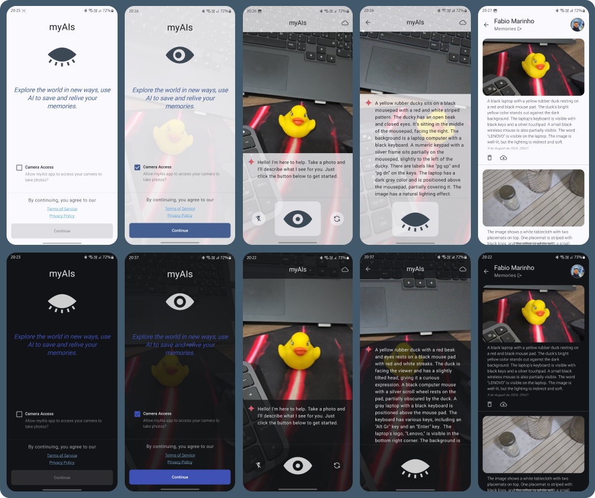

# myAIs

**myAIs** is an Android application primarily focused on accessibility. The app is designed to assist individuals with visual impairments by providing a simple and effective way to understand their surroundings. By leveraging artificial intelligence, myAIs describes images captured by the device's camera, offering users easy access to visual information. Additionally, the app features a user-friendly interface specifically designed to be easily navigable for those with visual limitations. The emphasis on accessibility is central to the app’s design and functionality, ensuring it serves as a genuinely useful and inclusive tool in the daily lives of its users.

## Features

- **AI-powered Image Description**: Provides detailed descriptions of images captured through the camera.
- **Save Visual Memories**: Allows users to save images and their descriptions for future reference.
- **User-Friendly Interface**: Designed with accessibility in mind, ensuring ease of use for visually impaired users.

## Setting Up the Gemini API Key for `myAIs`

The `myAIs` app requires an API key from the Gemini API to function correctly. This key is managed securely using the `secrets-gradle-plugin`. If the `secrets/apiKey.properties` file is not present, the project will use fallback values provided in the `default.properties` file.

### Steps to Set Up the Gemini API Key

1. **Ensure the `default.properties` File is Configured**:
    - In the root directory of the project, ensure there is a `default.properties` file. This file provides default values, including a placeholder for the Gemini API key.

   Example `default.properties`:
   ```properties
   GEMINI_API_KEY=*********************************
   GEMINI_BASE_URL="https://generativelanguage.googleapis.com/"
   DRIVE_BASE_URL="https://www.googleapis.com/"
   PROMPT_BASE_URL="http://localhost/"
   ```
    - The placeholder value `*********************************` will be used during the build process if no real key is provided.

### Important Notes

- **Do Not Modify Base URLs**: The base URLs for services used by the application are defined in `default.properties`. To maintain consistent functionality, avoid modifying these URLs.
- **Security**: Ensure that any files containing API keys, like `apiKey.properties`, are excluded from version control to keep your keys secure.

By following these steps, you can ensure that the `myAIs` project builds successfully in all environments.

## Screens


## Video Demonstrations

### Capture Feature
<video width="400" controls>
  <source src="media/capture.mp4" type="video/mp4">
  Your browser does not support the video tag.
</video>

### Permission Request
<video width="400" controls>
  <source src="media/permission.mp4" type="video/mp4">
  Your browser does not support the video tag.
</video>
